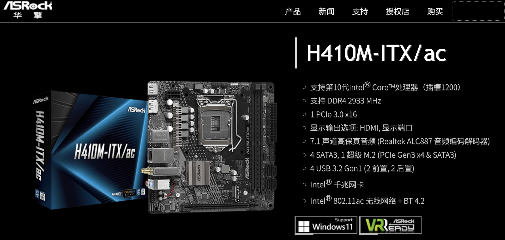
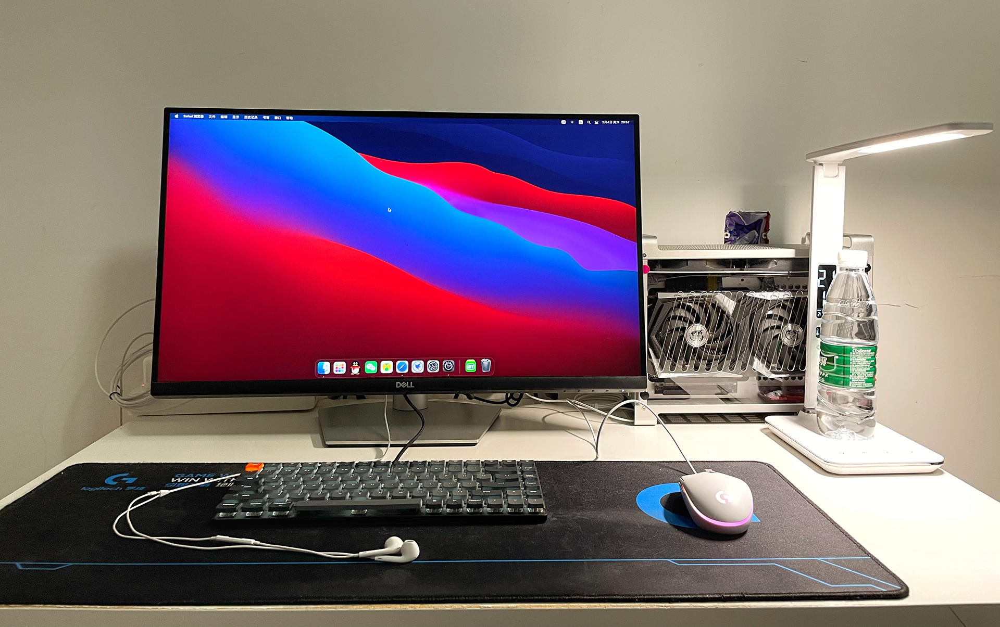

# ASRock-H410M-ITX Hackintosh OpenCore EFI

### OpenCore

[OpenCore 0.9.7](https://github.com/acidanthera/OpenCorePkg)

### OS Version Tested

- macOS Monterey 12.x
- macOS Ventura  13.x 

### Hardware

- Motherboard:ASRock-H410M-ITX
- Bios Version: 1.50（2021-8-6）
- CPU: Intel i5-10500
- RAM: Team Group Inc. 8GB(8G*2) DDR4 3000MHz
- SSD: 1.FANXIANG S500 Pro PCIe 3.0 1TB Windows11
- SSD: 2.Crucial MX500 500G MacOS Monertey 12.6.1 + Windows NTFS(250G)
- GPU: MSI Radeon RX6600XT GAMING X 8GB
- Audio: Realtek
- Ethernet: Intel Lan
- Wireless: BCM943602CS
- CPU Cooling：AXP90 + Noctua 9025*1
- Display: DELL S2722QC
- PSU: CORSAIR FX600 GOLD
- CASE: COOL FISH G5 PLUS
- CASE Cooling: Thermalright TOP TL-C12C-S 1225 Black * 2  BOTTOM TL-9015R Red * 1
- InputDevice: Keychron K3-84 White Light

### Bios Setup

| Name | Option |
| ----- | --- |

### Notes

 - Use [OpenCore Configurator](https://mackie100projects.altervista.org/opencore-configurator/) build your SMBIOS

### ScreenShot 

- COOL FISH G5 PLUS

### Contact Us

QQ Group: 23304408

